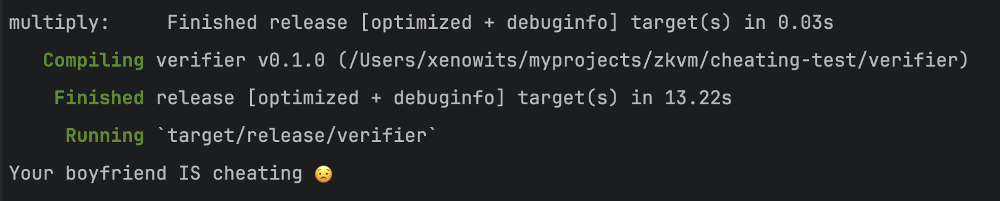

# Cheating proofs

Do you think your boyfriend might me cheating on you? You can't really know.

If you have rust installed and can get this repository to compile, you can actually know.

The following is a _honest_ conversation between such a couple:
```text
She: Can I check your call history?
He: No, not really. It's my private space. Btw, why do you want my call history?
She: Ummm...I just want to know if you're not talking to any of your exes.
He: Don't you trust me?
She: I trust you. (in her head: No, I don't trust you!!)
He: Okay, alright. There's a way I can prove that I ain't cheating. 
I know a guy who deals with zero knowledge proofs. He goes by the name "proof-master".
....conversation about zero knowledge proofs and the proof-master.....
She: Cool. I'm ready to share my list of probable suspects with the proof-master.
He: Alright. I'm ready to share my call history too with the proof-master.
...The proof-master now has both information: <suspected_contacts, bf_call_history>....
...The proof-master then calculates if the bf is cheating and creates a zk proof for that...
...The zk proof ensures the call-history is hidden from the gf and the gf can verify the truth about her bf...
```


## Quick Start

First, make sure [rustup](https://rustup.rs) is installed. This project uses a [nightly](https://doc.rust-lang.org/book/appendix-07-nightly-rust.html) version of [Rust](https://doc.rust-lang.org/book/ch01-01-installation.html). The [`rust-toolchain`](rust-toolchain) file will be used by `cargo` to automatically install the correct version.

### Boyfriend
For the boyfriend to prove that he is not cheating, run:
```
cargo run --bin=host --release
```


This creates a new binary file `receipt` containing the zk-proof in bytes format. These are long files and 
not intended for human readability.

### Girlfriend
For the girlfriend to verify if her boyfriend isn't lying, run:
```
cargo run --bin=verifier --release
```



[Structure of a zkVM Application]: https://dev.risczero.com/zkvm/developer-guide/zkvm-app-structure
